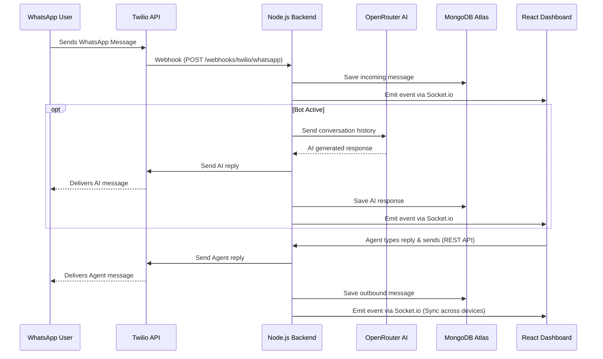

# WhatsApp V2 Handoff Platform 🚀

A modern, multi-tenant WhatsApp customer support and AI handoff platform. This application allows businesses to manage WhatsApp conversations, handle real-time messaging, leverage AI for automated responses, and seamlessly hand off conversations to human agents.

## 🌟 Key Features

- **Multi-Tenant Architecture**: Supports multiple teams and organizations, each with their own isolated data and assigned WhatsApp numbers.
- **Real-Time Communication**: Instant message delivery and UI updates powered by WebSockets (`Socket.io`).
- **AI Integration**: Built-in AI capabilities using OpenRouter to automate initial interactions.
- **Platform Administration**: Admin panel to manually provision and assign Twilio virtual numbers to specific teams.
- **Session-Based Security**: Secure, HTTP-only cookie-based authentication with `connect-mongo`.
- **Media Support**: Full support for handling media files, including PDFs and images.

## 🛠 Tech Stack

- **Frontend**: React 18, Vite, Lucide React (Icons)
- **Backend**: Node.js, Express.js, Socket.io
- **Database**: MongoDB (Atlas) with Mongoose
- **Integrations**: Twilio (WhatsApp API), OpenRouter (LLM Routing)

---

## 🏗 Architecture & Data Pipeline

The following diagram illustrates how messages flow through the system:



### Component Breakdown
1. **Twilio Webhooks**: Acts as the bridge between the WhatsApp network and your backend.
2. **Express Backend**: Validates Twilio signatures, processes business logic, and queues background jobs.
3. **MongoDB**: Stores sessions, users, teams, and conversation transcripts.
4. **Socket.io**: Pushes live updates to the React dashboard without requiring page refreshes.

---

## 💻 Local Development Setup

### Prerequisites
- Node.js (v18 or higher recommended)
- MongoDB Atlas Account (or local MongoDB)
- Twilio Account (with WhatsApp Sandbox or verified number)

### 1. Clone & Install
Install dependencies for both the backend and frontend:

```bash
# Install backend dependencies
cd handoff-backend
npm install

# Install frontend dependencies
cd ../handoff-dashboard
npm install
```

### 2. Environment Variables
Create a `.env` file in **both** directories.

**Backend (`handoff-backend/.env`)**
```env
NODE_ENV=development
PORT=8080
CLIENT_ORIGIN=http://localhost:5173
MONGO_URI=mongodb+srv://<username>:<password>@cluster0...
JWT_SECRET=your_super_secret_jwt_key

TWILIO_ACCOUNT_SID=your_twilio_sid
TWILIO_AUTH_TOKEN=your_twilio_auth_token
TWILIO_WHATSAPP_NUMBER=+14155238886
PUBLIC_WEBHOOK_BASE_URL=https://your-ngrok-url.ngrok-free.app

OPENROUTER_API_KEY=your_openrouter_api_key
OPENROUTER_MODEL=openai/gpt-4o-mini
```

**Frontend (`handoff-dashboard/.env`)**
```env
VITE_API_BASE=http://localhost:8080
```

### 3. Expose Localhost (ngrok)
To receive webhooks from Twilio locally, use [ngrok](https://ngrok.com/):
```bash
ngrok http 8080
```
*Copy the resulting HTTPS URL and update your `PUBLIC_WEBHOOK_BASE_URL` in the backend `.env`.*

### 4. Start the Application
You can start both servers using the provided bash script at the root:
```bash
./start-handoff.sh
```
Or start them manually:
- Backend: `cd handoff-backend && npm run dev`
- Frontend: `cd handoff-dashboard && npm run dev`

---

## 🚀 Production Deployment

### 1. Database (MongoDB Atlas)
- Ensure your cluster is running.
- In **Network Access**, allowlist your backend server's IP address (or use `0.0.0.0/0` if using a dynamic host).

### 2. Backend (Render / VPS)
- Deploy the `handoff-backend` folder to a service that supports WebSockets (like Render Web Services, Railway, or a VPS).
- Set all production environment variables.
- **Important**: If your frontend and backend are on different base domains (e.g., `app.vercel.app` and `api.onrender.com`), update `server.js` session cookies to use `sameSite: "none"` and `secure: true`. Using a custom domain (e.g., `app.domain.com` and `api.domain.com`) is highly recommended.

### 3. Frontend (Vercel / Netlify)
- Deploy the `handoff-dashboard` folder.
- Set the Build command to `npm run build` and output directory to `dist`.
- Set `VITE_API_BASE` to your production backend URL.

### 4. Twilio Webhook Configuration
In your Twilio Console, navigate to **Messaging** → **Senders** → **WhatsApp Senders**, and update the webhook URL to:
`https://<YOUR_PRODUCTION_BACKEND_URL>/webhooks/twilio/whatsapp`
